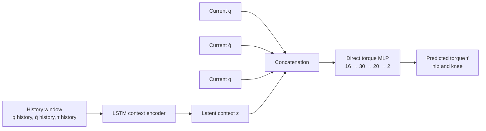

# CaDeLaC

Source code for **Context-Aware Deep Lagrangian Networks for Model Predictive Control (CaDeLaC)**.

This fork extends the original CaDeLaC repository with a simplified **2-DOF hip-knee exoskeleton setup** and an experimental **Context-Aware LSTM + Direct Torque MLP** architecture.

The original CaDeLaC implementation learns physics-consistent dynamics through a Deep Lagrangian Network. The direct-torque extension implemented in this fork instead uses:

- an LSTM to infer a latent context vector \(z\) from motion history,
- a feedforward MLP to map the current motion state and context directly to joint torque,
- subject-wise evaluation on an unseen exoskeleton participant.

> [!NOTE]
> The original DeLaN implementation remains available in the repository.  
> The currently active experimental path uses the direct torque MLP.

---

## Citation

When using the original CaDeLaC method, please cite:

```bibtex
@inproceedings{schulze2025contextawaredelan,
  author={Schulze, Lucas and Peters, Jan and Arenz, Oleg},
  booktitle={2025 IEEE/RSJ International Conference on Intelligent Robots and Systems (IROS)},
  title={Context-Aware Deep Lagrangian Networks for Model Predictive Control},
  year={2025},
  pages={6939--6946},
  doi={10.1109/IROS60139.2025.11246292}
}
```

Experiment videos for the original project are available on the
[CaDeLaC project website](https://schulze18.github.io/cadelac_website/).

---

## Table of Contents

- [Installation](#installation)
- [Datasets](#datasets)
- [Original CaDeLaC Usage](#original-cadelac-usage)
- [Exoskeleton Extension](#exoskeleton-extension)
  - [Research Goal](#research-goal)
  - [Architecture](#architecture)
  - [Current Configuration](#current-configuration)
  - [Dataset Preparation](#dataset-preparation)
  - [Training](#training)
  - [Evaluation](#evaluation)
  - [Recorded Results](#recorded-results)
  - [Interpretation and Limitations](#interpretation-and-limitations)
- [Repository Structure](#repository-structure)
- [Repository Hygiene](#repository-hygiene)
- [License](#license)

---

# Installation

## Training and Simulation Setup

### 1. Clone the Repository

```bash
git clone git@github.com:maxischw1/mlp_ip_cadelac.git
cd mlp_ip_cadelac
git submodule update --recursive --init
```

### 2. Create the Conda Environment

```bash
conda env create -f cadelac_env.yml
conda activate cadelac
```

### 3. Install CaDeLaC and Additional Dependencies

```bash
pip install -e .
pip install l4casadi==1.4.1 --no-build-isolation
```

### 4. Install Acados

The repository currently uses Acados `v0.4.3`.

Follow the
[official Acados installation guide](https://docs.acados.org/installation/).

```bash
cd acados
mkdir -p build
cd build

cmake -DACADOS_WITH_QPOASES=ON ..
make install -j4
```

Install the Python interface:

```bash
cd ../../
pip install -e acados/interfaces/acados_template
```

Add the following environment variables to `~/.bashrc`:

```bash
export LD_LIBRARY_PATH="$LD_LIBRARY_PATH:<acados_root>/lib"
export ACADOS_SOURCE_DIR="<acados_root>"
```

Reload the shell configuration:

```bash
source ~/.bashrc
```

---

## Real Robot Setup

### 1. Create a ROS Workspace

```bash
mkdir -p ~/catkin_ws/src
cd ~/catkin_ws/src

git clone git@github.com:maxischw1/mlp_ip_cadelac.git
cd mlp_ip_cadelac

git submodule update --recursive --init
```

### 2. Create the ROS Conda Environment

```bash
conda env create -f cadelac_ros_env.yml
conda activate cadelac_ros
```

### 3. Configure the Compiler

To ensure that Acados and Libfranka use the same compiler:

```bash
export CC="$HOME/miniconda3/envs/cadelac_ros/bin/x86_64-conda-linux-gnu-gcc"
export CXX="$HOME/miniconda3/envs/cadelac_ros/bin/x86_64-conda-linux-gnu-g++"
```

These variables may also be added to `~/.bashrc`.

### 4. Install CaDeLaC

```bash
pip install -e .
pip install l4casadi==1.4.1 --no-build-isolation
```

### 5. Install Libfranka

```bash
git clone --recurse-submodules https://github.com/frankarobotics/libfranka.git
cd libfranka

git checkout 0.13.3
git submodule update

mkdir -p build
cd build

cmake \
  -DCMAKE_BUILD_TYPE=Release \
  -DCMAKE_PREFIX_PATH=/opt/openrobots/lib/cmake \
  -DBUILD_TESTS=OFF \
  ..

make
```

### 6. Build the ROS Workspace

```bash
cd ~/catkin_ws

catkin_make \
  -DPYTHON_EXECUTABLE="$(which python)" \
  -DCMAKE_BUILD_TYPE=Release \
  -DFranka_DIR:PATH="<path-to-libfranka>/libfranka/build" \
  -j2

source devel/setup.bash
```

---

# Datasets

The datasets used by the original CaDeLaC experiments are available from
[Hugging Face](https://huggingface.co/datasets/schulze18/cadelac).

```bash
git clone \
  https://huggingface.co/datasets/schulze18/cadelac \
  cadelac/learning/datasets/
```

The exoskeleton extension uses separately generated `.pkl` datasets described in
[Dataset Preparation](#dataset-preparation).

---

# Original CaDeLaC Usage

## Evaluate the Pretrained IROS 2025 Model

```bash
python -m cadelac.learning.train_panda -l 2
```

## Train Residual Dynamics

```bash
python -m cadelac.learning.train_panda -l 0
```

## Evaluate a Trained Residual Model

```bash
python -m cadelac.learning.train_panda -l 1
```

## Train a Full DeLaN Robot Model

```bash
python -m cadelac.learning.train_panda -l 0 -f 1
```

## Evaluate a Full DeLaN Robot Model

```bash
python -m cadelac.learning.train_panda -l 1 -f 1
```

> [!NOTE]
> The dataset can require several minutes to load.  
> The original paper trained for 3000 epochs, although shorter runs may already
> provide useful performance.

---

## MuJoCo Controller Evaluation

Evaluate joint tracking under random loads:

```bash
python -m cadelac.control.eval_controllers_multiple_envs -c 2
```

Controller options:

| Argument | Controller |
|---:|---|
| `-c 0` | Nominal MPC |
| `-c 1` | MPC + EKF |
| `-c 2` | CaDeLaC context-aware MPC |

---

## Real Franka Robot

### Terminal 1: Launch the Hardware Interface

```bash
conda activate cadelac_ros
source ~/catkin_ws/devel/setup.bash

roslaunch \
  franka_example_controllers \
  effort_joint_controller.launch \
  robot_ip:="<robot-ip>" \
  load_gripper:=true \
  robot:=panda
```

### Terminal 2: Run the CaDeLaC Controller

```bash
conda activate cadelac_ros
source ~/catkin_ws/devel/setup.bash

cd ~/catkin_ws/src/mlp_ip_cadelac

python -m cadelac.ros.cadelac_node -c 2
```

> [!WARNING]
> Acados compiles a controller during its first execution. The initial compilation
> may require several minutes. Follow the safety procedure implemented in
> `cadelac/ros/cadelac_node.py` before executing the controller on hardware.

---

# Exoskeleton Extension

## Research Goal

The exoskeleton extension investigates whether a single learned dynamics model can
adapt its joint-torque prediction to an unseen human subject.

The current experimental question is:

> Can an LSTM infer a latent user and task context from recent motion history and
> enable a direct MLP to predict hip and knee torque for an unseen participant?

The model is trained on non-BT24 recordings and evaluated on BT24 recordings.

The BT24 test set contains:

- `ball_toss` movement segments,
- `incline_walk` movement segments.

This implements a subject-wise generalization experiment rather than a random
sample-level train/test split.

---

## Architecture

The current architecture contains two active learned components:

1. **Context LSTM**
   - processes a fixed history window,
   - outputs a latent context vector \(z\).

2. **Direct Torque MLP**
   - receives the current position, velocity and acceleration,
   - receives the latent context \(z\),
   - directly predicts hip and knee torque.



Mathematically, the active prediction path is:

\[
z_t =
\operatorname{LSTM}
\left(
x_{t-h:t-1}
\right)
\]

\[
\hat{\tau}_t =
\operatorname{MLP}
\left(
q_t,
\dot q_t,
\ddot q_t,
z_t
\right)
\]

where \(h\) denotes the history length.

---

## Implementation

The architecture is implemented in:

```text
cadelac/learning/models/context_aware_delan.py
```

The direct torque network is created through the existing `ComponentNN` class:

```python
self.torque_net = ComponentNN(
    3 * self.n_dof,
    self.n_dof,
    **kwargs_mlp
)
```

The current state input is constructed as:

```python
state_input = torch.cat((q, qd, qdd), dim=-1)
```

The latent context is appended inside `ComponentNN`, and the torque is predicted by:

```python
tau_pred = self.torque_net(state_input, enc_input)
```

The active dynamics method is selected through:

```python
self.dyn_model = self.dyn_model_mlp
```

The original Hessian-based DeLaN implementation remains in the class for
compatibility and comparison, but it is not used by the active direct-torque
forward path.

---

## Current Configuration

| Parameter | Value | Description |
|---|---:|---|
| Degrees of freedom | `2` | Left hip and left knee |
| History length | `15` | Number of previous timesteps |
| LSTM input size | `6` | \(q\), \(\dot q\), and \(\tau\) for two joints |
| LSTM hidden size | `10` | Hidden-state dimension |
| LSTM depth | `5` | Number of recurrent layers |
| Context dimension | `10` | Dimension of latent vector \(z\) |
| State input size | `6` | \(q\), \(\dot q\), and \(\ddot q\) |
| Complete MLP input | `16` | Six state values plus ten context values |
| MLP hidden layers | `[30, 20]` | Feedforward hidden-layer sizes |
| MLP output size | `2` | Hip and knee torque |
| MLP activation | `Tanh` | Hidden-layer activation |
| MLP trigonometric transform | Disabled | Raw state values are used |
| Maximum epochs | `3000` | Current full training configuration |
| Artificial data noise | Disabled | Real measurements already contain noise |

The two output dimensions represent:

```text
Joint 0: left hip torque
Joint 1: left knee torque
```

---

# Dataset Preparation

Dataset scripts are stored in:

```text
scripts/data/
```

Generated datasets are written to:

```text
cadelac/learning/datasets/panda/
```

---

## `scripts/data/make_exo_pkl.py`

Creates a simple single-left-leg 2-DOF dataset from:

```text
~/Downloads/Exo.csv
~/Downloads/Joint_Moments_Filt.csv
```

The script:

- extracts left hip and knee joint positions,
- extracts or derives joint velocities,
- computes joint accelerations,
- reads filtered joint moments,
- converts angles from degrees to radians,
- splits the recording into trajectory segments,
- writes the format expected by the CaDeLaC training pipeline.

Run:

```bash
python scripts/data/make_exo_pkl.py
```

Primary output:

```text
cadelac/learning/datasets/panda/exo_hip_knee_delan_2dof_left_only.pkl
```

---

## `scripts/data/make_all_exo_pkls.py`

Creates the main all-trials exoskeleton datasets.

Expected source directory:

```text
~/Downloads/codeocean_exo_data
```

The script searches recursively for matching:

```text
Exo.csv
Joint_Moments_Filt.csv
```

Run:

```bash
python scripts/data/make_all_exo_pkls.py
```

Generated files include:

```text
cadelac/learning/datasets/panda/exo_hip_knee_delan_2dof_left_all_trials.pkl
cadelac/learning/datasets/panda/exo_hip_knee_delan_2dof_right_all_trials.pkl
cadelac/learning/datasets/panda/exo_hip_knee_delan_2dof_left_all_trials_context.pkl
```

The current LSTM-plus-MLP experiment uses:

```text
cadelac/learning/datasets/panda/exo_hip_knee_delan_2dof_left_all_trials_context.pkl
```

Filtered joint moments from `Joint_Moments_Filt.csv` are used as torque targets.

For the simplified Context-Aware experiment:

```python
diff_tau = tau
```

This means that the residual target handled by the existing training pipeline is
equal to the measured torque target.

---

## `scripts/data/fix_exo_pkl_time.py`

Repairs the time axis of a generated exoskeleton dataset and recomputes
accelerations from velocity.

The intended fixed timestep is:

```python
dt = 0.005  # 200 Hz
```

Run:

```bash
python scripts/data/fix_exo_pkl_time.py
```

The script creates a backup before modifying its target dataset.

> [!CAUTION]
> Use this script only when the generated dataset contains nonuniform or
> inconsistent timestamp information.

---

# Training

The main training implementation is:

```text
cadelac/learning/train_panda.py
```

The direct torque MLP architecture is configured through:

```python
"net_arch_mlp": [30, 20]
```

The final model uses the following filename pattern:

```text
mlp_lstm_epochs_<epochs>exo_hip_knee_delan_2dof_left_all_trials_context.torch
```

The 3000-epoch model is stored at:

```text
cadelac/learning/trained_models/res_model/panda/ContextAware/
└── mlp_lstm_epochs_3000exo_hip_knee_delan_2dof_left_all_trials_context.torch
```

---

## Full GPU Training

From the repository root:

```bash
mkdir -p logs

python -m cadelac.learning.train_panda \
  -c 1 \
  -i 0 \
  -s 0 \
  -r 0 \
  -l 0 \
  -m 1 \
  -f 0 \
  2>&1 | tee "logs/mlp_lstm_train_3000_$(date +%Y%m%d_%H%M).log"
```

### Training Arguments

| Argument | Meaning |
|---:|---|
| `-c 1` | Use CUDA when available |
| `-i 0` | Use CUDA device 0 |
| `-s 0` | Use random seed 0 |
| `-r 0` | Disable interactive plot rendering |
| `-l 0` | Start a new model instead of loading one |
| `-m 1` | Save checkpoints and the final model |
| `-f 0` | Use the Context-Aware residual branch |

> [!IMPORTANT]
> Use `-l 0` for new training.  
> The load-model path is intended for evaluation of an existing checkpoint.

---

## Training Wrapper

The existing wrapper can also be used:

```bash
bash scripts/training/train_exo_context_current_config.sh
```

It executes the current configuration stored in `train_panda.py`.

The corresponding log is written to:

```text
logs/exo_context_current_config_train.log
```

---

## Evaluate the Current Model Through `train_panda.py`

```bash
python -m cadelac.learning.train_panda \
  -l 1 \
  -f 0 \
  -m 0 \
  -r 0 \
  -c 0
```

This loads the configured model, evaluates the BT24 split and generates the
legacy `plot_torques` output.

---

# Evaluation

Evaluation scripts are stored in:

```text
scripts/evaluation/
```

The existing evaluation pipeline is reused for the direct torque MLP because the
public model interface remains:

```python
tau_pred, dEdt = model(q, qd, qdd, lstm_input)
```

The direct MLP therefore remains compatible with the existing torque plotting
and metric scripts.

---

## Complete Evaluation Package

The recommended entry point is:

```text
run_context_eval_package.py
```

Set the trained model:

```bash
MODEL_PATH="$PWD/cadelac/learning/trained_models/res_model/panda/ContextAware/mlp_lstm_epochs_3000exo_hip_knee_delan_2dof_left_all_trials_context.torch"
```

Run the full pipeline:

```bash
python run_context_eval_package.py "$MODEL_PATH"
```

The runner executes:

1. the full BT24 model evaluation,
2. a complete BT24 torque plot,
3. a `ball_toss` torque plot,
4. an `incline_walk` torque plot,
5. a left-leg `ball_toss` torque grid,
6. a left-leg `incline_walk` torque grid,
7. metric CSV generation,
8. log collection,
9. Desktop ZIP creation.

---

## Evaluation Outputs

The MLP-specific output directories are:

```text
logs/torque_zoom_mlp_hist15_3000/
logs/left_leg_torque_grid_mlp_hist15_3000/
```

Typical generated files include:

```text
exo_context_zoomed_torque_full_BT24.png
exo_context_zoomed_torque_full_BT24_metrics.csv

exo_context_zoomed_torque_ball_toss.png
exo_context_zoomed_torque_ball_toss_metrics.csv

exo_context_zoomed_torque_incline_walk.png
exo_context_zoomed_torque_incline_walk_metrics.csv

BT24_left_ball_toss_torque_grid.png
BT24_left_ball_toss_torque_grid_metrics.csv

BT24_left_incline_walk_torque_grid.png
BT24_left_incline_walk_torque_grid_metrics.csv
```

The Desktop package follows the naming pattern:

```text
mlp_ip_cadelac_mlp_hist15_3000_eval_outputs_<timestamp>.zip
```

The ZIP intentionally contains only evaluation artifacts:

- generated graphics,
- metric CSV files,
- training and evaluation logs,
- a package-content summary.

It does **not** contain:

- the trained checkpoint,
- the dataset,
- the repository source code,
- temporary Python files.

---

## Individual Evaluation Scripts

### Checkpoint Metrics

Evaluate available Context-Aware checkpoints:

```bash
python scripts/evaluation/evaluate_context_checkpoints.py
```

Generated metric file:

```text
logs/exo_context_checkpoint_metrics.csv
```

Plot the checkpoint metrics:

```bash
python scripts/evaluation/plot_context_checkpoint_metrics.py
```

Generated figures:

```text
logs/exo_context_torque_mse_over_epochs.png
logs/exo_context_torque_rmse_over_epochs.png
```

---

### Full BT24 Torque Plot

```bash
python scripts/evaluation/plot_zoomed_context_torque_prediction.py \
  --model "$MODEL_PATH" \
  --output-dir logs/torque_zoom_mlp_hist15_3000
```

### Ball-Toss Torque Plot

```bash
python scripts/evaluation/plot_zoomed_context_torque_prediction.py \
  --model "$MODEL_PATH" \
  --segment ball_toss \
  --output-dir logs/torque_zoom_mlp_hist15_3000
```

### Incline-Walk Torque Plot

```bash
python scripts/evaluation/plot_zoomed_context_torque_prediction.py \
  --model "$MODEL_PATH" \
  --segment incline_walk \
  --output-dir logs/torque_zoom_mlp_hist15_3000
```

### Ball-Toss Torque Grid

```bash
python scripts/evaluation/plot_left_leg_torque_grid.py \
  --model "$MODEL_PATH" \
  --movement ball_toss \
  --output-dir logs/left_leg_torque_grid_mlp_hist15_3000
```

### Incline-Walk Torque Grid

```bash
python scripts/evaluation/plot_left_leg_torque_grid.py \
  --model "$MODEL_PATH" \
  --movement incline_walk \
  --output-dir logs/left_leg_torque_grid_mlp_hist15_3000
```

---

# Recorded Results

The following values were reported by the completed 3000-epoch run:

| Metric | Recorded value |
|---|---:|
| Training samples | `41,224` |
| Total reported parameters | `7,746` |
| LSTM parameters | `4,350` |
| Reported MLP parameters | `3,396` |
| Training epochs | `3,000` |
| Total training time | `450.2 s` |
| Final training loss | `5.225e-04` |
| Final inverse-dynamics loss | `5.225e-04` |
| Reported torque MSE | `1.436e-03` |
| Reported power MSE | `1.693e-04` |

The model was trained on BT23 movement segments and evaluated on unseen BT24
`ball_toss` and `incline_walk` segments.

> [!NOTE]
> The displayed loss values are batch- and normalization-dependent. Comparisons
> should use the same dataset split, normalization and evaluation scripts.

---

# Interpretation and Limitations

## Primary Valid Output

The physically relevant primary output of the direct MLP is:

```text
predicted total residual torque
```

The main comparisons should therefore use:

- measured versus predicted torque,
- total torque MSE,
- total torque RMSE,
- joint-wise hip and knee errors,
- movement-specific Ball-Toss and Incline-Walk plots.

---

## No Explicit Physical Torque Decomposition

The direct torque MLP does not explicitly learn:

\[
H(q)\ddot q
\]

\[
c(q,\dot q)
\]

\[
g(q)
\]

as separately identifiable physical components.

Legacy evaluation code may still calculate apparent inertia, Coriolis and gravity
terms by setting selected MLP inputs to zero. These values are not guaranteed to
represent a physically valid decomposition.

They should therefore not be interpreted in the same way as the corresponding
terms produced by a physics-consistent DeLaN.

---

## Power Output

The model retains the interface:

```python
return tau_pred, dEdt
```

with:

```python
dEdt = torch.sum(qd * tau_pred, dim=1)
```

This keeps the direct MLP compatible with the existing training and evaluation
pipeline.

For the direct black-box MLP, this value represents mechanical power computed
from predicted torque. It does not independently prove energy conservation.

---

## Legacy Components

The original inertia and potential networks remain in
`ContextAwareDeLaN` for compatibility and comparison.

The active direct-torque path does not use them to compute `tau_pred`.

Consequently:

- inactive legacy parameters may still appear in total parameter counts,
- model checkpoints may contain inactive DeLaN parameters,
- the current implementation prioritizes a minimal and reversible code change.

A future cleanup may separate the direct MLP into a dedicated model class.

---

# Repository Structure

```text
mlp_ip_cadelac/
├── cadelac/
│   ├── control/
│   ├── learning/
│   │   ├── datasets/
│   │   │   └── panda/
│   │   ├── models/
│   │   │   └── context_aware_delan.py
│   │   ├── trained_models/
│   │   └── train_panda.py
│   └── ros/
│
├── scripts/
│   ├── data/
│   │   ├── make_exo_pkl.py
│   │   ├── make_all_exo_pkls.py
│   │   └── fix_exo_pkl_time.py
│   │
│   ├── training/
│   │   ├── train_exo_context_current_config.sh
│   │   └── eval_exo_context_current_config.sh
│   │
│   └── evaluation/
│       ├── evaluate_context_checkpoints.py
│       ├── plot_context_checkpoint_metrics.py
│       ├── plot_zoomed_context_torque_prediction.py
│       └── plot_left_leg_torque_grid.py
│
├── run_context_eval_package.py
├── cadelac_env.yml
├── cadelac_ros_env.yml
├── LICENSE
└── README.md
```

---

# Repository Hygiene

Generated experiment artifacts should remain local.

The following should generally not be committed:

```text
logs/
exports/
generated plots
generated metric CSV files
generated .pkl datasets
trained .torch models
checkpoint directories
Desktop ZIP packages
Python cache files
editor backup files
```

Before committing, inspect the repository:

```bash
git status --short
```

Check whether a file is ignored:

```bash
git check-ignore -v <path>
```

Check formatting problems:

```bash
git diff --check
```

The repository should contain source code, reusable scripts and documentation,
while generated data and experimental artifacts should be shared separately.

---

# License

See [`LICENSE`](LICENSE) for the repository license.
